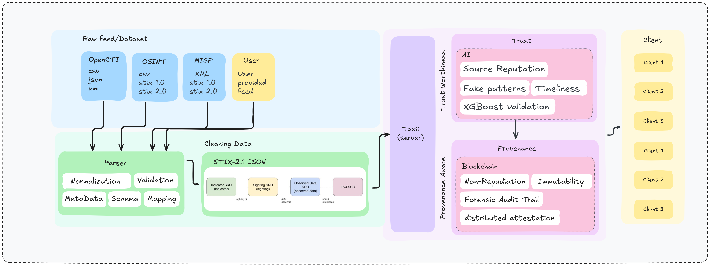

# ThreatChain

**Provenance-aware threat intelligence with verifiable trust scoring**

ThreatChain is a threat intelligence pipeline that preserves the full lineage of every indicator from ingestion through normalization. It computes explainable trust scores and records tamper-evident attestations on a blockchain ledger, giving security teams the context they need to act with confidence.

---

## The Problem

Modern threat feeds are a black box. You receive an IP address flagged as malicious, but you don't know if it came from a reliable source, whether it's been corroborated by others, or if it was modified during processing. When incidents happen, reconstructing the decision trail is nearly impossible.

Existing platforms like MISP and OpenCTI focus on sharing and enrichment, but they don't solve the fundamental trust problem: *how do you know which indicators are worth acting on?*

---

## How ThreatChain Works

ThreatChain treats every indicator as evidence that needs a receipt. The pipeline has four main components:

**Parser & Normalizer**  
Ingests feeds from OpenCTI, MISP, OSINT sources, and custom formats. Everything normalizes to STIX 2.1, but we preserve the original metadata, validation results, and transformation steps. No context is lost.

**Trust Scoring Engine**  
An XGBoost model evaluates each indicator against multiple signals: historical source reputation, corroboration from independent feeds, fake pattern detection, and timeliness decay. The output is a trust score with feature importance, so you understand *why* something scored high or low.

**Blockchain Ledger**  
Every indicator gets a cryptographic attestation recorded on a permissioned blockchain. The attestation includes provenance metadata hashes and validation receipts, creating an immutable forensic audit trail. Raw feed data stays private—only fingerprints go on-chain.

**Taxi Server**  
A TAXII 2.1-compliant server exposes the enriched, scored indicators. Clients query for high-trust IOCs, retrieve provenance chains, or pull full audit trails for incident response.

---

## What Makes This Different

**Full provenance tracking**: Most platforms normalize data and discard the transformation history. ThreatChain keeps everything—original format, parser decisions, validation errors, mapping choices.

**Explainable trust scores**: You get a number between 0 and 1, plus the features that drove it. "This IP has a 0.87 trust score because three independent sources reported it within 24 hours, and the source reputation is high."

**Blockchain attestations**: Immutable proof that an indicator existed at a specific time with specific metadata. Critical for legal proceedings, compliance audits, and proving you acted on the best available intelligence.

**Privacy-first ledger**: Only hashes and metadata go on-chain. The actual threat data lives in your infrastructure under your control.

---

## Architecture

The diagram shows the complete flow from raw feeds through scoring and attestation to client consumption:

Feeds arrive in multiple formats (OpenCTI exports, MISP XML, STIX bundles, custom CSV). The parser normalizes everything to STIX 2.1 JSON while capturing metadata. Cleaned data flows to the trust scoring model, which assigns scores based on source reputation, fake patterns, corroboration, and timeliness. Scored indicators and their provenance metadata are hashed and attested on the blockchain. Clients pull enriched indicators through the TAXII server.

---

## Current Status

**Active development—architecture and research phase.**  

We're building the core parser, finalizing the trust scoring model, and prototyping the blockchain integration. The repository currently holds design documents, architecture diagrams, and project planning materials. Code releases are planned within the next year.

If you're interested in contributing evaluation datasets, discussing threat intel workflows, or collaborating on design decisions, open an issue or discussion.

---

## Roadmap

- Finalize parser contracts for major feed formats (OpenCTI, MISP, STIX bundles)
- Curate labeled evaluation datasets for trust scoring validation
- Deploy trust scoring prototype with feature importance reporting
- Implement blockchain attestation layer (evaluating Hyperledger Fabric vs. Quorum)
- Build TAXII 2.1 server with provenance query endpoints
- Document integration patterns for common SIEM/SOAR platforms
- Public beta with anonymized feed telemetry and community feedback

---

## Contributing

We need practical input from SOC teams and threat intel practitioners. If you have ideas about trust scoring signals, provenance metadata that would be useful, or integration requirements, open a discussion.

For dataset contributions or private threat intel sharing under a data-use agreement, open an issue with a summary and we'll coordinate securely.

---

## License

Apache 2.0 License. See `LICENSE` for details.
