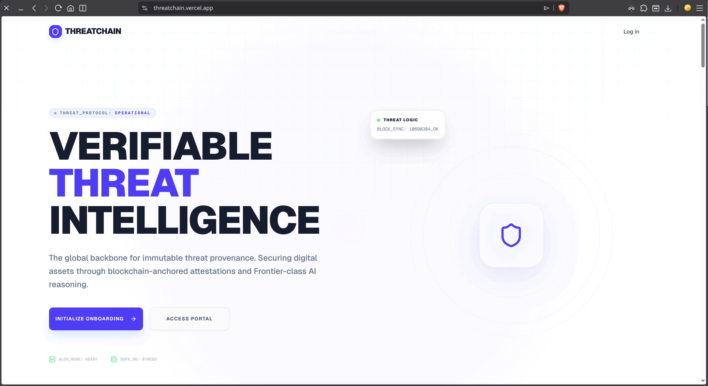
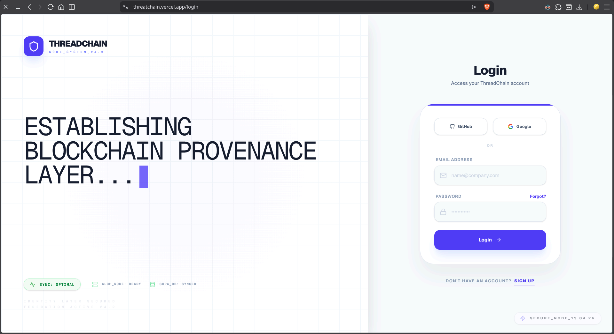
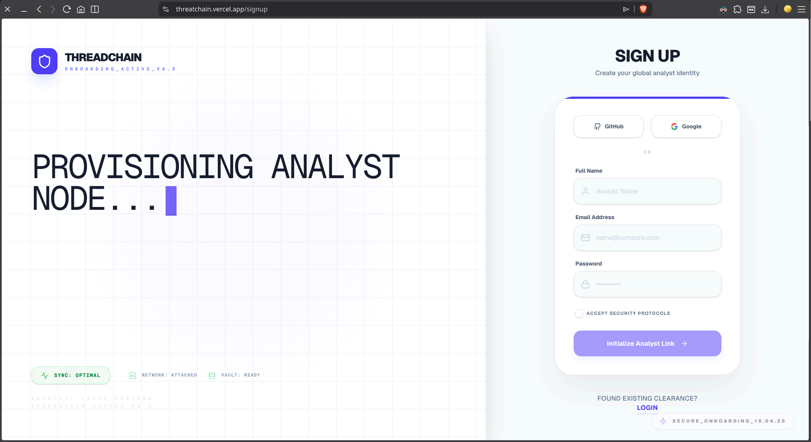
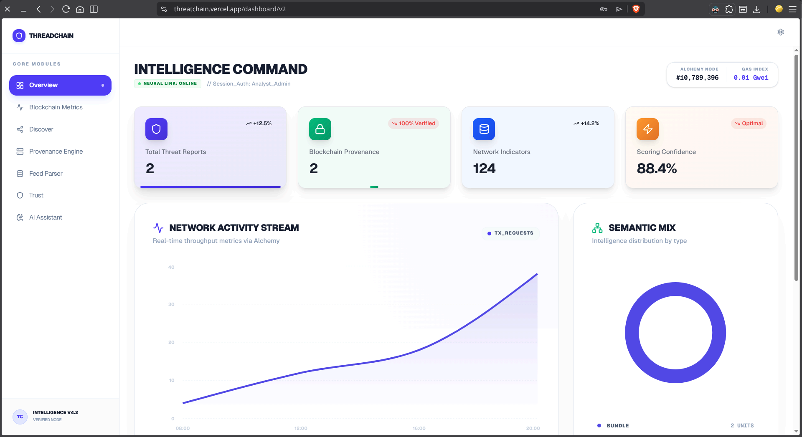
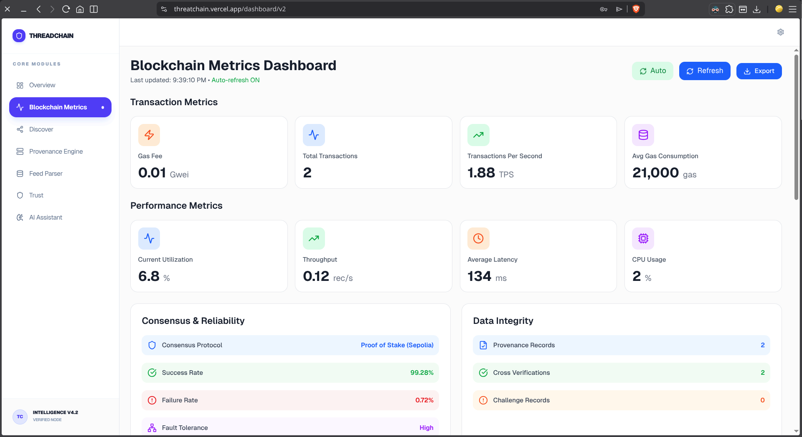
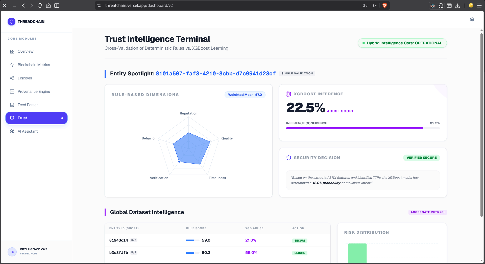
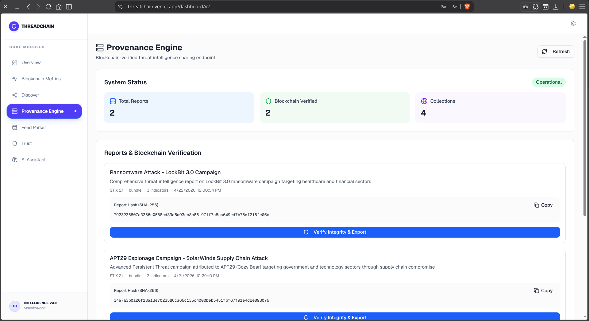
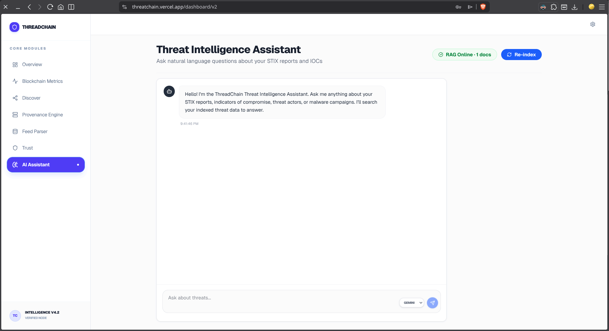

# ThreatChain

**Provenance-aware threat intelligence with verifiable trust scoring**

ThreatChain is a threat intelligence pipeline that preserves the full lineage of every indicator—from ingestion through normalization—computes explainable trust scores, and records tamper-evident attestations on a blockchain ledger. Security teams get the context they need to act with confidence.

---

## The Problem

Modern threat feeds are a black box. You receive an IP flagged as malicious, but you don't know whether it came from a reliable source, whether it's been corroborated, or whether it was modified in transit. When incidents happen, reconstructing the decision trail is nearly impossible.

Existing platforms like MISP and OpenCTI focus on sharing and enrichment but don't solve the fundamental trust problem: *how do you know which indicators are actually worth acting on?*

---

## How It Works

ThreatChain treats every indicator as evidence that needs a receipt. The pipeline has four main components.

**Parser & Normalizer** ingests feeds from OpenCTI, MISP, OSINT sources, and custom formats. Everything normalizes to STIX 2.1, while preserving original metadata, validation results, and transformation steps—no context is lost.

**Trust Scoring Engine** evaluates each indicator against multiple signals using an XGBoost model: historical source reputation, corroboration from independent feeds, fake pattern detection, and timeliness decay. The output is a trust score with feature importance, so you understand *why* something scored high or low.

**Blockchain Ledger** records a cryptographic attestation for every indicator, including provenance metadata hashes and validation receipts. This creates an immutable forensic audit trail. Raw feed data stays private—only fingerprints go on-chain.

**TAXII Server** exposes enriched, scored indicators via a TAXII 2.1-compliant interface. Clients query for high-trust IOCs, retrieve provenance chains, or pull full audit trails for incident response.

---

## What Makes This Different

**Full provenance tracking.** Most platforms normalize data and discard the transformation history. ThreatChain keeps everything—original format, parser decisions, validation errors, and mapping choices.

**Explainable trust scores.** You get a value between 0 and 1 plus the features that drove it. *"This IP has a 0.87 trust score because three independent sources reported it within 24 hours and the source reputation is high."*

**Blockchain attestations.** Immutable proof that an indicator existed at a specific time with specific metadata—critical for legal proceedings, compliance audits, and demonstrating you acted on the best available intelligence.

**Privacy-first ledger.** Only hashes and metadata go on-chain. Actual threat data lives in your infrastructure under your control.

---

## Architecture

Feeds arrive in multiple formats (OpenCTI exports, MISP XML, STIX bundles, custom CSV). The parser normalizes everything to STIX 2.1 JSON while capturing full metadata. Cleaned data flows to the trust scoring model, which assigns scores based on source reputation, corroboration, fake pattern detection, and timeliness. Scored indicators and their provenance metadata are hashed and attested on the blockchain. Clients pull enriched indicators through the TAXII server.

## Platform Preview

| Landing Page | Auth Flow
| :---: | :---: |
|  |  |

| Signup Page | Intelligence Command
| :---: | :---: |
|  |  |

| Blockchain Metrics | Trust Intelligence |
| :---: | :---: |
|  |  |

| Provenance Engine | RAG Based AI Assistant |
| :---: | :---: |
|  |  |

View More Screenshots

| Feed Parser | Provenance Hub |
| :---: | :---: |
|  |  |

---

## Current Status

**Production-ready.**

ThreatChain has transitioned from research to a fully implemented cyber threat intelligence pipeline. The system is verified for real-world deployment, supporting multi-source feed ingestion, neural trust scoring, and blockchain-anchored provenance. 

Key achievements:
- **Parser Core:** Standardized on STIX 2.1 with full support for MISP and OpenCTI formats.
- **Trust Scoring:** Validated XGBoost model with production-level confidence and explainability.
- **Blockchain Layer:** Fully integrated Ethereum-based attestations for immutable forensic audit trails.
- **Intelligence Hub:** Operational TAXII 2.1 server and RAG-powered analyst assistant.

If you're looking to integrate ThreatChain into your SOC or intelligence workflow, refer to the [Usage Guide](USAGE_GUIDE.md).

---

## Future Enhancements

- **Advanced Pattern Recognition:** Integrating deep learning models for complex campaign correlation.
- **Enhanced Privacy:** Implementing Zero-Knowledge Proofs (ZKP) for sensitive indicator sharing.
- **Interoperability:** Native integration plugins for major SIEM/SOAR platforms (Splunk, Sentinel, Palo Alto XSOAR).
- **Decentralized Governance:** Community-driven trust signal weight adjustments.
- **Expanded TAXII Support:** Advanced filtering and subscription models for real-time intel streaming.

---

## Contributing

We need practical input from SOC teams and threat intel practitioners. If you have ideas about trust scoring signals, provenance metadata requirements, or integration needs, open a discussion.

For dataset contributions or private threat intel sharing under a data-use agreement, open an issue with a summary and we'll coordinate securely.

---

## License

Apache 2.0. See `LICENSE` for details.
