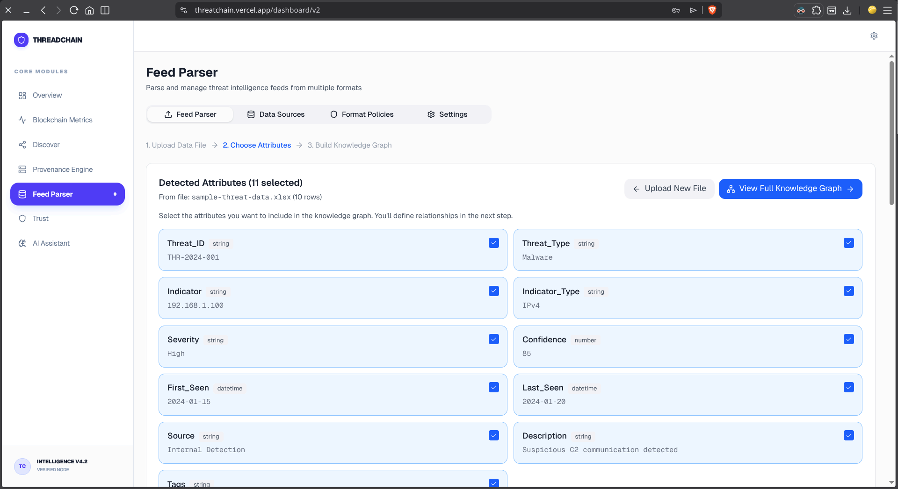
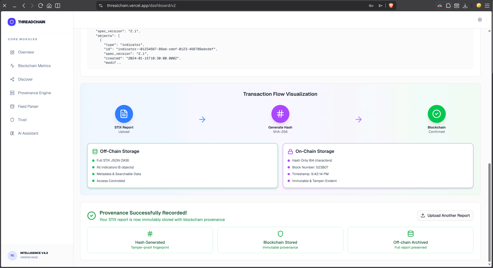
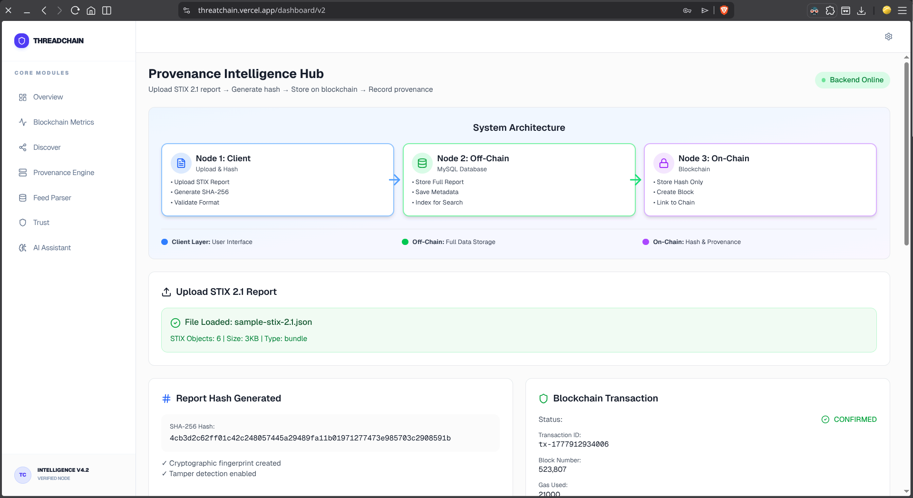

# ThreadChain - Usage Guide

## How to Use the CSV to Knowledge Graph Workflow

### Step 1: Upload CSV File

1. Navigate to the **Feed Management** page (Feeds in sidebar)
2. Click **"Select CSV File"** button
3. Choose your CSV file containing threat intelligence data
4. The system will automatically parse and detect all attributes

### Step 2: Select Attributes



1. After upload, you'll see all detected attributes with:
   - **Attribute name** (column header from CSV)
   - **Data type** (auto-detected: string, number, datetime, array)
   - **Sample value** (first row value)

2. Click on any attribute card to **select/deselect** it
3. Selected attributes will be highlighted in blue
4. You need at least **2 attributes** selected to proceed

### Step 3: Build Knowledge Graph

1. Click **"Build Knowledge Graph"** button
2. You'll be taken to the Knowledge Graph page

### Step 4: Define Relationships

On the Knowledge Graph page:

1. **Add Relationships** using the three dropdowns:
   - **Source Attribute**: Where the relationship starts (e.g., "indicator_value")
   - **Relationship Type**: How they connect (e.g., "indicates", "related_to")
   - **Target Attribute**: Where the relationship points (e.g., "threat_type")

2. Click **"Add"** to create the relationship

3. Example relationships:
   ```
   indicator_value → indicates → threat_type
   threat_type → has_severity → severity
   source → observed_in → timestamp
   ```

4. You can add multiple relationships to build a complex graph

### Step 5: Generate Graph

1. Click **"Generate Knowledge Graph"** button
2. The system will:
   - Create nodes for each attribute in relationships
   - Draw edges (connections) between them
   - Display the visual graph on canvas

### Step 6: Export to STIX 2.1

1. Once the graph is generated, click **"Export STIX 2.1"** button
2. A JSON file will be downloaded containing:

## Provenance Tracking



ThreatChain automatically records the provenance of your data on the blockchain. You can view the status of your reports in the **Provenance Engine** or **Provenance Hub**.



## Sample CSV Format

Your CSV should have headers in the first row:

```csv
indicator_type,indicator_value,threat_type,confidence,timestamp,source,description,severity
ipv4-addr,192.168.1.100,malware,85,2024-01-15T10:30:00Z,OpenCTI,Malicious IP detected,high
domain,malicious-site.com,phishing,92,2024-01-15T11:45:00Z,MISP,Phishing domain,critical
```

## Tips

- Use descriptive column names in your CSV
- The system auto-detects data types, but you can verify them
- Start with simple relationships, then add more complex ones
- The graph visualization updates in real-time
- STIX export includes ALL rows from your CSV, not just the graph nodes

## Sample File

A sample CSV file (`sample-threat-data.csv`) is included in the project root for testing.
